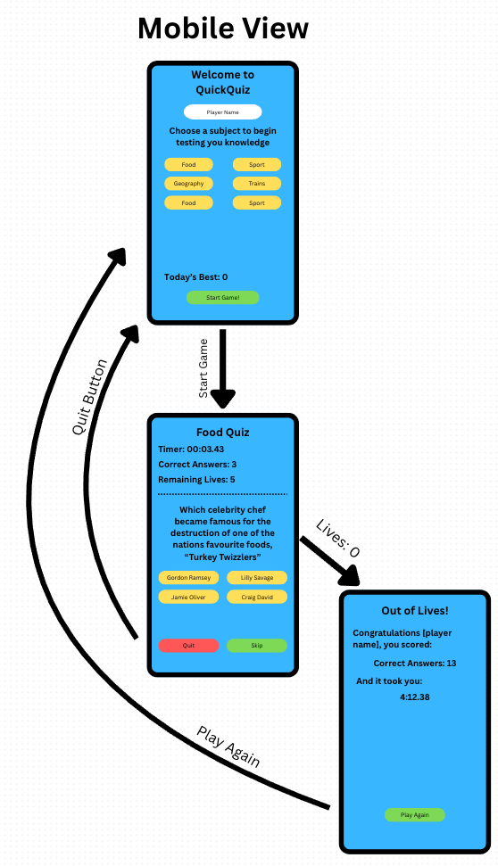

# Menu

- <a href="/Readme.md">Project Breifing (Readme.me)</a>
- Feedback & Notes - <b>You are here</b>
- <a href="Criteria.md">Criteria Notes & References</a>
---

### Documentaion Evolution

The documentation continues to evolve throught the project development. As I make changes and improvements, I make sure to document that here

Additionally, the commit notes are detailed, and frequent, with small changes. Allowwing an assessor to observe the project's evolution in thourough detail.

Reading the project Criteria revealed that the documentation assets should be kept distinctly seperate from the project's files, so I'll be doing that for the next commit.

---

### Wireframe Evolution

#### <b>Change 1:</b> Initial Mobile Design</b> 
Originally, all subject category buttons were stacked side by side in two columns, to maximise tap area on small screens. But this was not user friendly, especially for users with accesability requirements. Unfortunately, even a right handed person may struggle to reach their thumb over to the left hand column

#### Revised Layout for Desktop Responsiveness & UX Improvements
After feedback and testing, the mobile layout was adjusted to support a **a single column button grid**. This improves the visual balance and makes better use of horizontal space on smaller screens.

| Before | After |
|--------|-------|
|  |  |

The desktop wireframe now uses the 2-column layout to ensure **visual consistency** and reduce DOM complexity when switching views using media queries.

---

