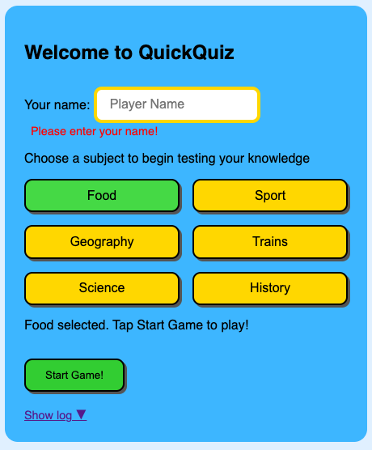
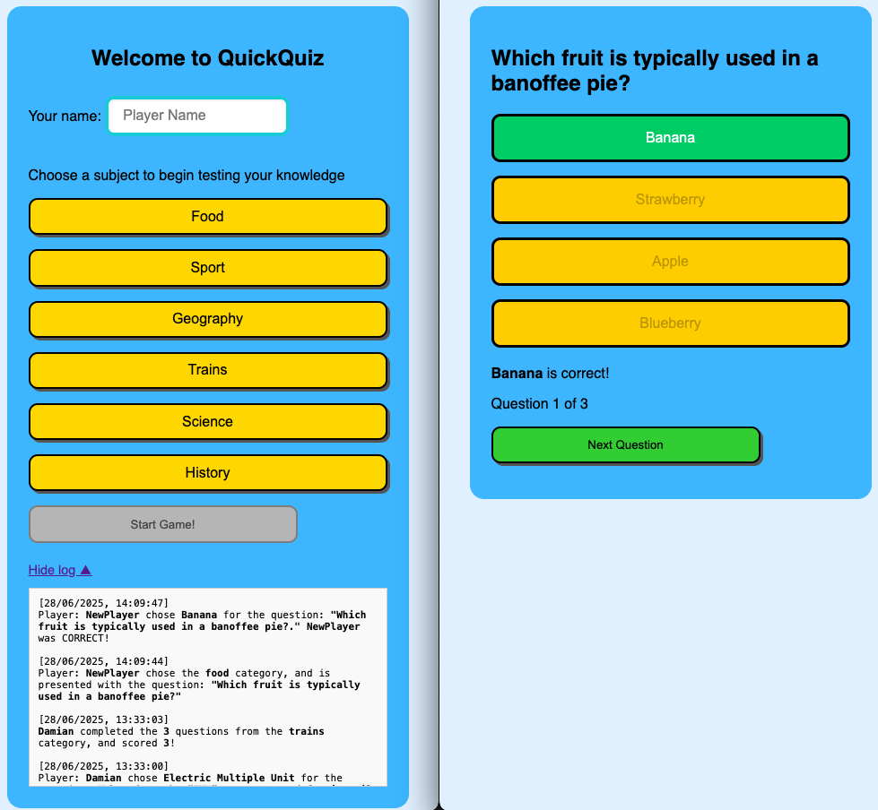
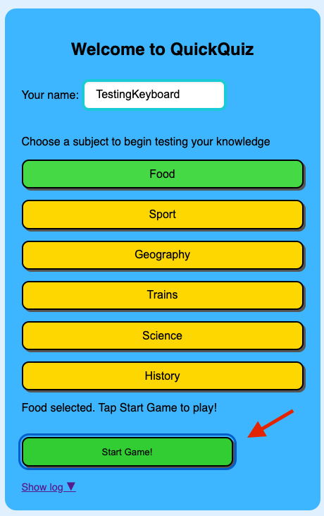
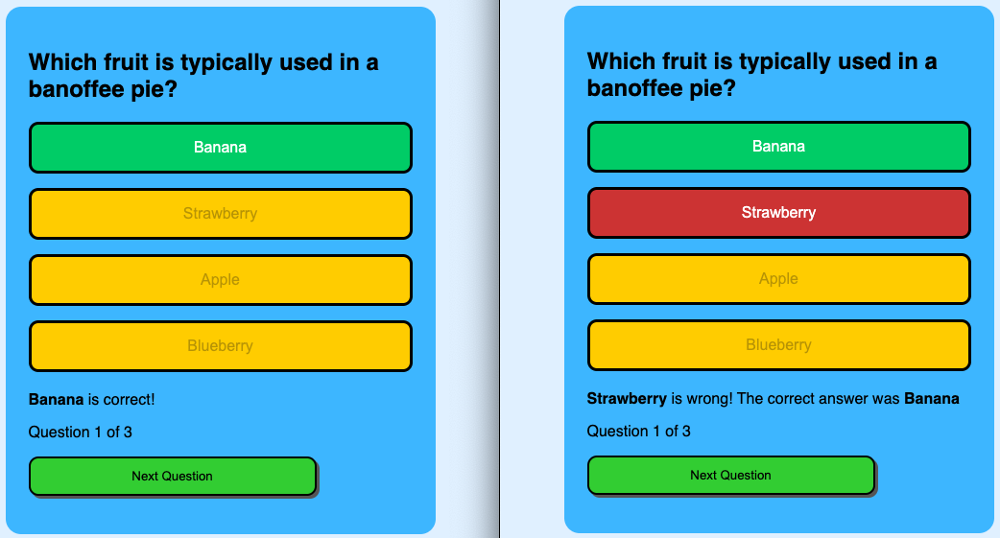
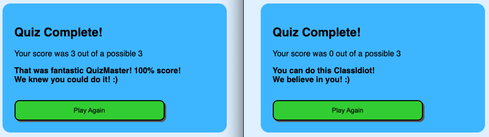
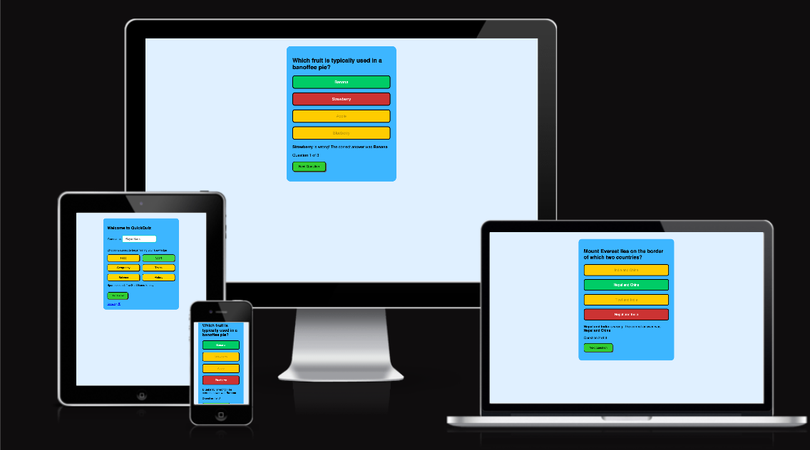
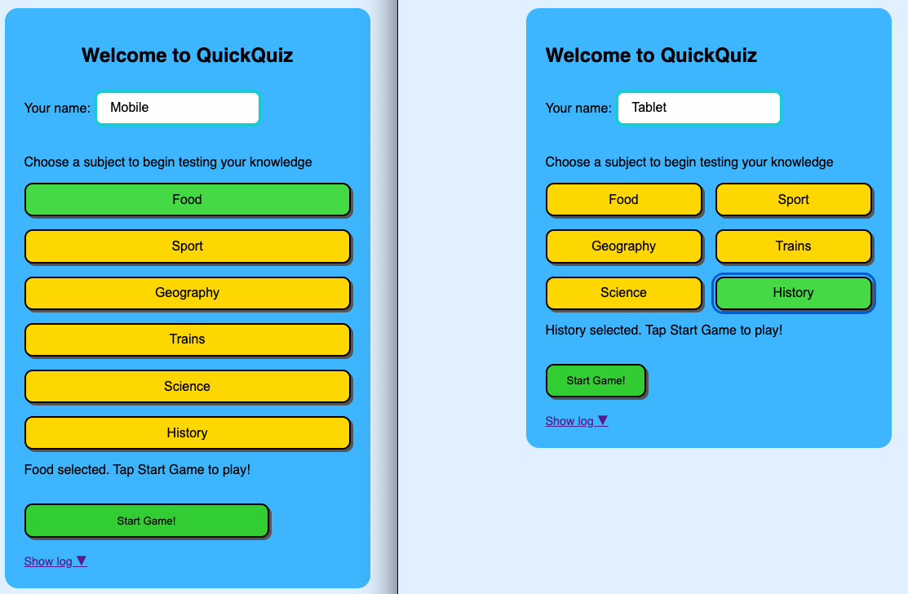
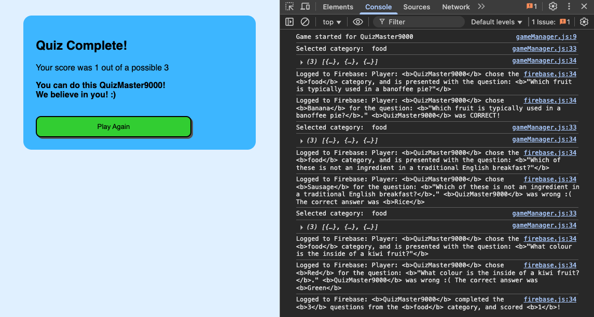
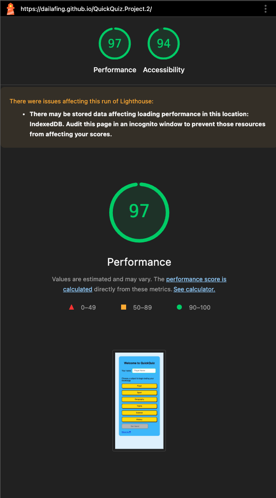
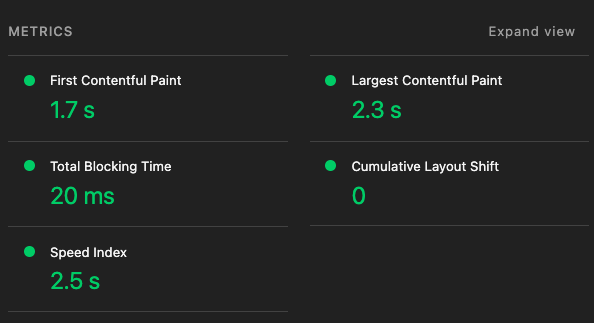

# Menu

- <a href="/Readme.md">Project Breifing (Readme.me)</a>
- <a href="Feedback_Notes.md">Feedback & Notes</a>
- <a href="Criteria.md">Criteria Notes & References</a>
- Application Testing - <b>You are here</b>
---

### Application Testing

#### Criteria 3

Test an interactive Front end web application through the development,
implementation and deployment stages.

- 3.1 Explain the principles of automated and manual testing and when each might be deployed.

- 3.2 Design and implement testing procedures (automated or manual) to assess functionality, usability and responsiveness
of the web application.

- 3.3 Insert screenshots of the finished project that align to relevant user stories.

- 3.4 Apply test procedures during development and implementation stages and test to ensure the deployed version matches
the development version.

- 3.5 Fully document the results of well-planned testing procedures (automated or manual) to assess the website’s
functionality, usability and responsiveness.

#### Phase 1 Testing

---

| Test Case                        | Expected Result                                                                | Actual Result                                                          | Pass/Fail | Evidence |
|:---------------------------------|:-------------------------------------------------------------------------------|:-----------------------------------------------------------------------|:---------:|:--------:|
| Name validation                  | Shows error if name is left empty before starting the quiz                     | Red border and validation message shown                                | ✅        | Fig.1    |
| Firebase logging                 | Adds a log entry after each question answered                                  | Log updates appear in Firebase viewer                                  | ✅        | Fig.2    |
| Start button accessibility       | Can start quiz using keyboard (e.g. Tab + Enter)                               | Category selectable with space bar, but cant start game with spacebar  | ❌        | Fig.3    |
| Aria tabbing accessibility       | Aria voice over should readout categories correctly                            | Typo in the aria label causing mispronounciation                       | ❌        |          |
| Answer feedback                  | Selected answer shows immediate visual feedback (green/red) + ARIA message     | Visuals were fine, but Aria needed some fixes                          | ❌        | Fig.4    |
| Score calculation                | Final score reflects correct/incorrect answers                                 | Score is accurate                                                      | ✅        | Fig.5    |
| Responsive layout (mobile)       | Layout adapts well on phone screen (no overlap or cutoff)                      | No layout bugs on iPhone/Android                                       | ✅        | Fig.6    |
| Responsive layout (tablet)       | Layout is usable and readable on mid-sized screens                             | Buttons and text scale correctly                                       | ✅        | Fig.7    |
| Keyboard navigation              | All interactive elements are reachable with Tab, with visual focus indication  | Category selection works, but the answer buttons do not select.        | ❌        |          |
| JavaScript error resilience      | No unhandled JS errors in console when interacting with UI                     | Console remains clean                                                  | ❌        | Fig.8    |
| Lighthouse accessibility check   | Site scores 90+ on Lighthouse Accessibility audit                              | Passed with strong ARIA and contrast marks                             | ✅        | Fig.9    |
| Lighthouse performance check     | Site scores 90+ on Lighthouse Performance audit                                | Page load and response times acceptable                                | ✅        | Fig.10   |
| Lighthouse SEO check             | Site passes Lighthouse SEO checks                                              | Document has title, meta tags, etc.                                    | ✅        | Fig.11   |
| Text visibility                  | No overlapping text; all fonts readable on all devices                         | All visible without zooming                                            | ✅        | Fig.6    |
| Colour contrast compliance       | Text and background colour combinations pass WCAG AA contrast ratio            | Everything passes, except the 'show log'. Which would not be in live   | ✅        | Fig.12   |
| Audio feedback (if applicable)   | Screen reader reads ARIA live feedback on answer selection                     | NVDA or VoiceOver responds correctly                                   | ✅        |          |

---

#### Screenshots

##### Fig.1 - Name Box Validation - PASSED

##### Fig.2 - Firebase Logging - PASSED

##### Fig.3 - Testing Space Bar Accessability - FAILED

##### Fig.4 - Selecting Right/Wrong Answers for visual feedback - PASS

##### Fig.5 - Score counter works as expected - PASS

##### Fig.6 - No Layout problems on various devices - PASS

##### Fig.7 - Looks great on both, and is responsive - PASS

##### Fig.8 - Console still has log information - FAILED

##### Fig.9 & Fig.10 - Lighthouse Test Results - PASS

##### Fig.11 - Lighthouse SEO Test - PASS

##### Fig.12 - Accessability Contrast test - PASS

----

#### Phase 2 Testing

---

| Test Case                        | Expected Result                                                                | Actual Result                                                          | Pass/Fail | Evidence |
|:---------------------------------|:-------------------------------------------------------------------------------|:-----------------------------------------------------------------------|:---------:|:--------:|
| Start button accessibility       | Can start quiz using keyboard (e.g. Tab + Enter)                               | Category selectable with space bar, but cant start game with spacebar  |         |     |
| Aria tabbing accessibility       | Aria voice over should readout categories correctly                            | Typo in the aria label causing mispronounciation                       |         |          |
| Answer feedback                  | Selected answer shows immediate visual feedback (green/red) + ARIA message     | Visuals were fine, but Aria needed some fixes                          |         |     |
| Keyboard navigation              | All interactive elements are reachable with Tab, with visual focus indication  | Category selection works, but the answer buttons do not select.        |         |          |
| JavaScript error resilience      | No unhandled JS errors in console when interacting with UI                     | Console remains clean                                                  |         |     |