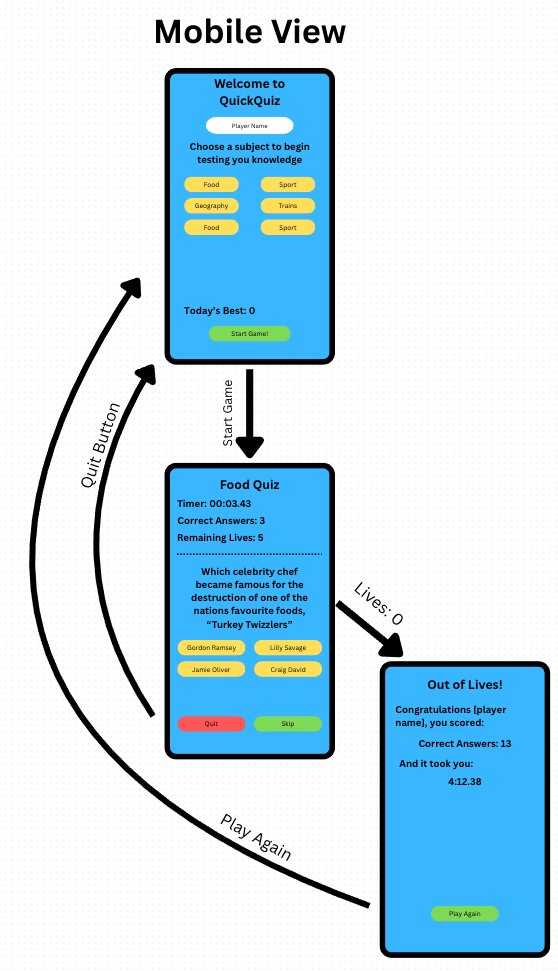

## Project Briefing

### **Working Title**
**QuickQuiz** – an accessible, responsive general-knowledge quiz

---

### **Purpose**

QuickQuiz is a  front-end web application that delivers a short set of multiple-choice questions. It is designed to:

- Help users test their general knowledge in under two minutes  
- Demonstrate interactive JavaScript, responsive layout, accessibility best practices, and UX principles suitable for grading

---

### **How the User Will Use It**

1. **Landing / Start screen** – The user optionally enters a display name and presses **“Start Quiz”**  
2. **Question screen** – Each question is shown with four answer buttons. The user selects one; immediate colour-coded feedback appears, and the score counter updates  
3. **Results screen** – After the final question, the total score, percentage, and a short message (e.g. _“Nice work Alice, 6 / 8 correct!”_) are displayed, along with buttons to **Restart** or **Share** the result

---

### **Inputs and Outputs**

| **Stage**      | **Input from User**                      | **Immediate Output / Feedback**                                                 |
|----------------|------------------------------------------|----------------------------------------------------------------------------------|
| **Start**       | Optional name, click “Start Quiz”        | Quiz card appears; focus moves to first answer                                   |
| **During quiz** | Click / keyboard-select an answer        | Button turns green/red; ‘Correct!’ or ‘Incorrect’ announced via ARIA live region |
| **End**         | Click “Restart” or “Share”               | New game begins _or_ share link copied to clipboard                              |

---

### **Data Privacy Note**

The application stores **no personal data**; all state exists **in memory** for the current session only.

---

### **Wireframes & Design Planning**

