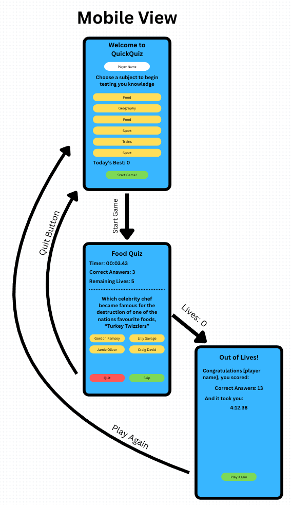

# Menu

- Project Breifing (Readme.me) - <b>You are here</b>
- <a href="Documentation/Feedback_Notes.md">Feedback & Notes</a>
- <a href="Documentation/Criteria.md">Criteria Notes & References</a>
---

### Project Briefing 

#### **Working Title**
**QuickQuiz** – an accessible, responsive general-knowledge digital quiz, that people can play online to test their knowledge in a range of topics.

---

### **Purpose**

QuickQuiz is a  front-end web application that delivers a short set of multiple-choice questions. It is designed to:

- Help users test their general knowledge
- Demonstrate interactive JavaScript, responsive layout, accessibility best practices, and UX principles suitable for grading

---

### **How the Player Will Use It**

1. **Landing / Start screen** – The user optionally enters a display name and presses **“Start Quiz”**  
2. **Question screen** – Each question is shown with four answer buttons. The user selects one; immediate colour-coded feedback appears, and the score counter updates  
3. **Results screen** – After the final question, the total score, percentage, and a short message (e.g. _“Nice work Alice, 6 / 8 correct!”_) are displayed, along with buttons to **Restart** or **Share** the result

---

### **Inputs and Outputs**

| **Stage**      | **Input from User**                      | **Immediate Output / Feedback**                                                 |
|----------------|------------------------------------------|----------------------------------------------------------------------------------|
| **Start**       | Optional name, click “Start Quiz”        | Quiz card appears; focus moves to first answer                                   |
| **During quiz** | Click / keyboard-select an answer        | Button turns green/red; ‘Correct!’ or ‘Incorrect’ announced via ARIA live region |
| **End**         | Click “Restart” or “Share”               | New game begins _or_ share link copied to clipboard                              |

---

### **API Questions**

The questions will be loaded from an API JSON for fast loading and making that public may help other learners who may want to make use of the endpoint.

---

### **Accessability**

To meet requirements for Accessability, QuickQuiz will:

- Allow users to use their Keyboard to navigate and interact with the game

- Naturally has contrasting colours.

- Will avoid using larger text by default, since users with those needs will most likely have their own settings for enlarged fonts. So this will avoid having fonts that are too large to be ledgible.

- Make use of ARIA lables and ARIA live region for feedback.

- Screen reader friendly.

- Accessible text (not hidden behind elements, clear labels, etc.)

---

### **JavaScript Logic**

To meet requirements for the demonstration of JavaScript Logic, QuickQuiz will:

- Make use of conditional logic. For example, if the correct answer to a question is on button 3, the application will check if the user has clicked button 3, and award the user with a point.
    - Similarly, the else conditional will deduct a 'life' from the user.
    - Each time the next question is about to be loaded, we should ensure the lives are not 0. If so, the end game screen should be displayed, rather than the next question.

- Demonstrate sucsessful linkage to a .js file

- Will pass a linter test (eg. JSLint)

---

### **Functional HTML & CSS**

- Demonstrate clean and valid HTML.

- Demonstrate HTML Best Practices (Semantic structure, CSS in external stylesheet).

---

### **Misc. Criteria**

- Will adjust layout depending on screen size.

- Will design features that allow the user to start and control actions (e.g. clicking buttons, filling forms) and receive feedback (e.g. visual change, success messages).

- Will organise code and assets files in directories by file type. and make use of external files.

---

### **Data Privacy Note**

The application stores **no personal data**; all state exists **in memory** for the current session only.

---

### **Wireframes & Design Planning**

#### Desktop View

#### Mobile View

---
